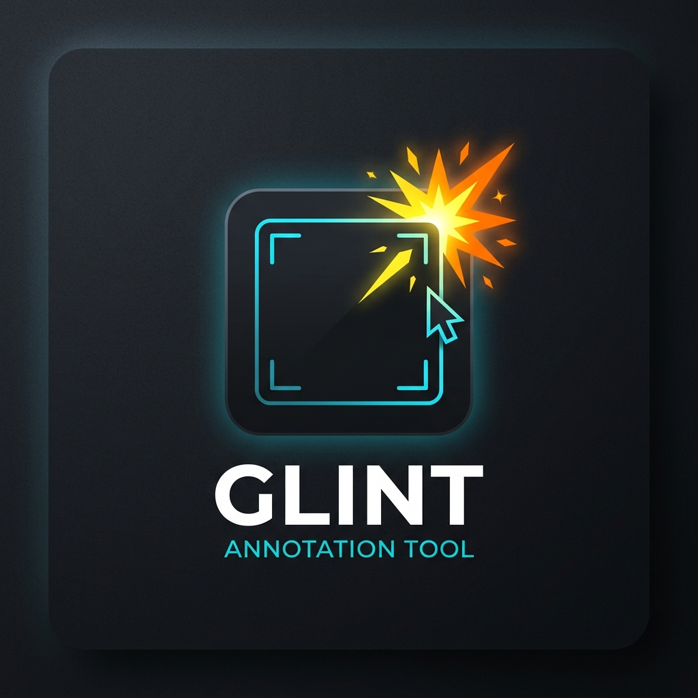

# Glint

<p align="center">
  
</p>
Glint is a fast, minimal, high-utility screenshot annotation tool designed for power users. Built with C# and Avalonia UI, it runs natively on Linux (Wayland/X11) and macOS. Glint embraces a terminal-friendly, keyboard-first approach, taking screenshots directly via standard input (stdin) and offering immediate clipboard output.

## Features

- **Standard Input/Output:** Perfectly integrations with `grim`, `slurp`, and other CLI screenshot tools by reading image data directly from `stdin`.
- **Minimalist UI:** High-contrast, completely flat, and ultra-compact UI designed to stay out of your way.
- **Tools:** Freehand, Arrow, Rectangle, Ellipse, Text, and an instant live-rendering Blur tool.
- **Keyboard-First:** Every tool and action is mapped to a single keypress.
- **Cross-Platform:** Available as a single self-contained binary for Linux and macOS.

## Usage

Glint is designed to be piped into directly from your screenshot tool of choice.

**Wayland (Sway / Hyprland):**
```bash
grim -g "$(slurp)" - | glint
```

**macOS:**
```bash
screencapture -i -c && pbpaste | glint
```

Once the image opens, you can use the keyboard shortcuts to annotate, and when you are done, simply press `Ctrl+C` (or `Cmd+C`) to copy the annotated image straight to your clipboard. Glint will automatically exit.

## Keyboard Shortcuts

| Shortcut | Action |
| --- | --- |
| `D` | Draw (Freehand) |
| `A` | Arrow |
| `R` | Rectangle |
| `E` | Ellipse |
| `T` | Text |
| `S` | Numbered Steps |
| `B` | Blur |
| `X` | Redaction (Pixelate) |
| `M` | Loupe (Zoom/Magnify) |
| `Ctrl+Z` / `⌘Z` | Undo |
| `Ctrl+Shift+Z` / `⌘⇧Z` | Redo |
| `Ctrl+C` / `⌘C` | Copy image to clipboard |
| `Ctrl+S` / `⌘S` | Quick Save (to Desktop or configured `save_dir`) |
| `Ctrl+Shift+S` / `⌘⇧S` | Save As... |
| `Ctrl+O` / `⌘O` | Open image file from disk |
| `Esc` | Close application / Cancel text input |

## Configuration

Glint creates a default configuration file on first launch. It is located at `~/.config/glint/config.toml` (or `$XDG_CONFIG_HOME/glint/config.toml`).

You can customize your default tool, color, stroke width, save directory, and even define a custom color palette!

```toml
# Glint Configuration File

# Directory to save quick screenshots
# Can use ~/ for home directory
save_dir = "~/Desktop"

# Default selected tool on startup
# Options: Freehand, Arrow, Rectangle, Ellipse, Highlighter, Text, Step, Blur, Redaction, Loupe
default_tool = "Freehand"

# Default color index (0-7)
default_color_index = 0

# Default stroke width index (0-3)
default_stroke_index = 1

# Optional custom 8-color palette (hex codes). Uncomment to use!
# palette = ["#FF3B30", "#FF9500", "#FFCC00", "#34C759", "#007AFF", "#AF52DE", "#FFFFFF", "#000000"]
```

## Installation

### Pre-compiled Binaries
You can download the single-file, self-contained binaries for Linux (`linux-x64`) and macOS (`osx-arm64` / `osx-x64`) from the [Releases page](../../releases). 

Make the binary executable and move it to your PATH:
```bash
chmod +x glint
sudo mv glint /usr/local/bin/
```

### Build from Source
Ensure you have the [.NET 10 SDK](https://dotnet.microsoft.com/) installed.

```bash
git clone https://github.com/yourusername/glint.git
cd glint
dotnet build -c Release
```

To build a self-contained, single-file binary:
```bash
dotnet publish -c Release -r linux-x64 --self-contained true -p:PublishSingleFile=true
```

## Motivation
Most screenshot annotation tools are either slow, bloated with unnecessary features, or require multiple clicks to get a simple red arrow onto an image. Glint was built to fix this by being a purely utilitarian application that perfectly seamlessly into Linux Wayland environments and scriptable workflows.
